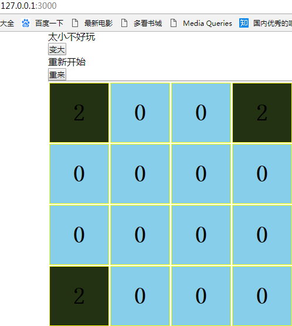
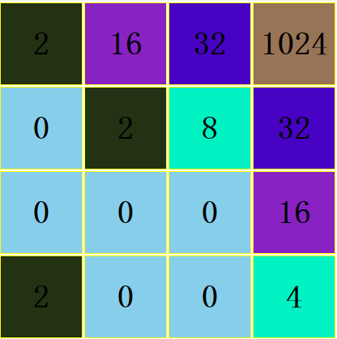
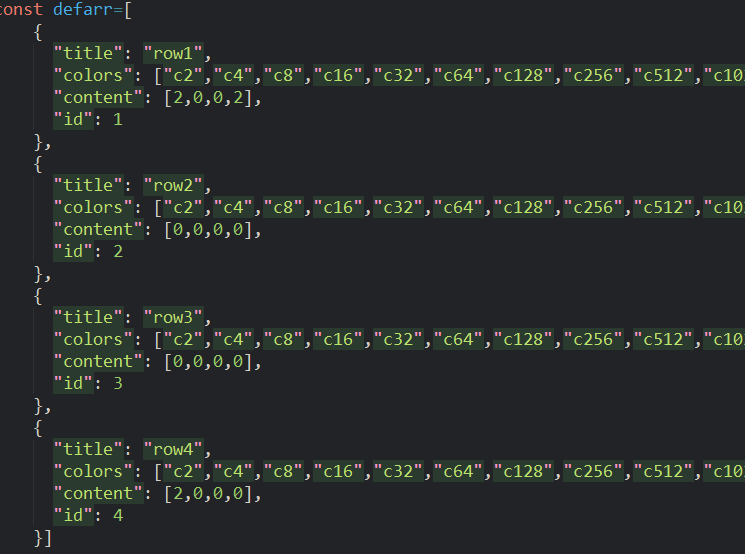
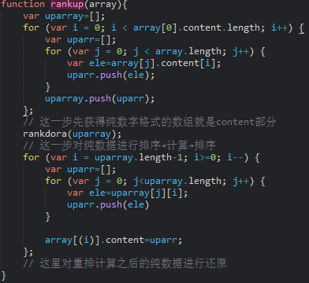
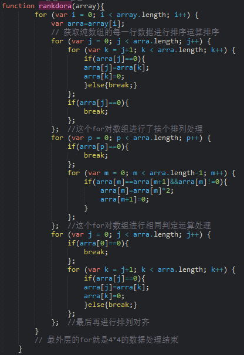
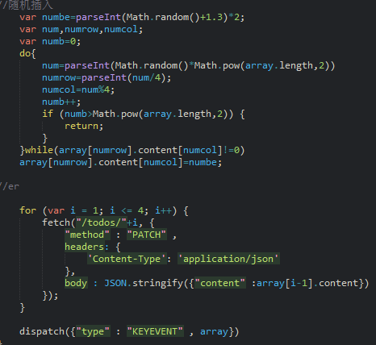

## 曾经火爆的数字游戏2048

> 技术栈：react redux redux-thunk ramda fetch  json-server 

## 使用说明

需要安装json-server

$ npm install -g json-server

```
#克隆项目
git clone https://github.com/chen406226/react-2048game.git

# 安装依赖
npm install

#项目根目录执行cmd命令

npm run server

# 本地开发环境 访问http://localhost:3000

# 用键盘↑↓←→控制游戏方向
# 结束点击[重来]按钮。
```

## 项目说明
json-server模拟RESTful的路由，提供暂时的数据。每次结束请恢复初始数据，就是页面中的重来按钮。这样db文件里的数据就会恢复如初。
突然想起了2048这款曾经火爆男女老少皆宜的益智游戏，于是突发奇想的用react写个试试，其实react也没做啥大头都在逻辑上面，于是就有了这个游戏。

## 总结
写这个游戏的时候思路还是很清晰的，因为玩的多，所以就给它分为三部分走就可以了，排序→计算→排序这不就是游戏的命令要求吗，因为写出来了所以也没搜官方的其他的代码，不知道人家的是什么思路，反正写出来就不看就是这么傲娇！有兴趣大家可以搜搜，搜完一定记得告诉我（说重点就好了）。

写逻辑游戏的时候可能你会没有思路，但按照自己的逻辑来写总会出来的，即使你看了别人的代码也不会复刻出一样的。喜欢逻辑的朋友也可以找我还有俄罗斯方块，五子棋，贪吃蛇都是react写的←_←

## 项目截图

初始的都是这个布局，因为没随机，刚开始测试就直接固定值。等功能实现了也懒得改了。



玩游戏也是要有策略的←_←



# 来一波分析代码只提取片段部分。

### 数据机构如图

title:表示其在4*4中的第几行位置

colors：是显示不同数字的背景颜色的类名，

content就是其在4*4中对应的数字



在代码里加了注释，但是只有主体思想具体代码自己体会因为是有4个方向的所以这个重配是有4个的这里只举例一个进行注释




不写注释再看差点懵逼了



根据游戏规则每次操作都是要随机一个出来填补空位的，指导不能计算且没空为止，所以随机的数不能出现在已经有数值的位置上面.然后数值交由json-server改变db.json文件数据，和react组件store.进行视图渲染更新



#### 因为写着玩的所以代码不整洁，页面也是丑爆 配色更是亮瞎眼 嗯！但主要看逻辑吧  小主QQ 451969599
